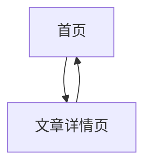

## 1. Product Overview
人情社故志是一个温暖共鸣派风格的博客系统，专注于人文情感、生活故事与社会观察内容。采用React + TypeScript + Vite技术栈，为关注人文、喜欢共鸣、重视情绪体验的阅读者提供温暖真诚的阅读体验。

## 2. Core Features

### 2.1 Feature Module
我们的博客需求包含以下主要页面：
1. **首页**：导航栏、Hero区域、文章卡片列表
2. **文章详情页**：文章内容展示、返回导航

### 2.2 Page Details

| Page Name | Module Name | Feature description |
|-----------|-------------|---------------------|
| 首页 | 导航栏 | 显示Logo"人情社故志"、导航菜单（当下时刻、故事精选、金句合集）、链接图标+"致谢+"按钮 |
| 首页 | Hero区域 | 主标题+副标题居中显示，CTA按钮带轻微放大动画 |
| 首页 | 文章卡片 | Grid布局展示文章列表，包含标题、摘要、金句、标签、阅读更多链接 |
| 文章详情页 | 文章内容 | 完整文章内容展示，包含标题、正文、返回按钮 |

## 3. Core Process
用户访问首页浏览文章卡片列表，点击"阅读更多"进入文章详情页查看完整内容，可通过返回按钮回到首页继续浏览。

## 4. User Interface Design
### 4.1 Design Style
- 主色调：#D49A6A（焦糖棕）用于按钮、链接、强调文字
- 背景色：#F9F6F2（浅米白）营造温暖氛围
- 强调色：#A86B5A（手写强调）用于标题底纹
- 互补色：#719E91（柔和薄荷绿）用于次要按钮、标签背景
- 文本主色：#333333（深灰黑）
- 文本辅助色：#666666（中灰）
- CTA/链接：#BF5A3C（深焦糖）
- 字体：Logo和标题使用Georgia/Serif，正文使用Roboto/Sans
- 布局：卡片式设计，圆角12px，带阴影效果
- 动效：hover时卡片上移4px，按钮放大1.05倍

### 4.2 Page Design Overview

| Page Name | Module Name | UI Elements |
|-----------|-------------|-------------|
| 首页 | 导航栏 | 固定高度64px，白底+1px底部边框，左Logo中导航右按钮布局 |
| 首页 | Hero区域 | 80px上边距，32px左右边距，40px下边距，标题副标题居中 |
| 首页 | 文章卡片 | Grid布局gap 24px，flex纵向布局，padding 24px，圆角12px |
| 文章详情页 | 文章内容 | 标准排版，Georgia标题，Roboto正文，1.6行高 |

### 4.3 Responsiveness
桌面优先设计，支持响应式布局：
- ≥960px：3列文章卡片
- 600-959px：2列文章卡片
- <600px：1列文章卡片，移动端优化